# AutoffOffice
Microsoft Power Automate scheduled cloud flow to automatically set Automatic Replies in case of Out of Office.

## Power Automate
### Sign in
Head over to [Microsoft Power Automate](https://powerautomate.microsoft.com/) and click `Sign in` in the top right corner. This will take you to your companies sign in page.

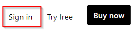

After a successful login, you will be redirected to the Power Automate landing page. At the left hand side of the screen, you will see the Power Automate main menu.

### Add a connection
 First we need to set up a Connection so your AutoffOffice flow can interact with Office 365 Outlook.

 From the main menu unfold the `Data` section and click the `Connections` button.

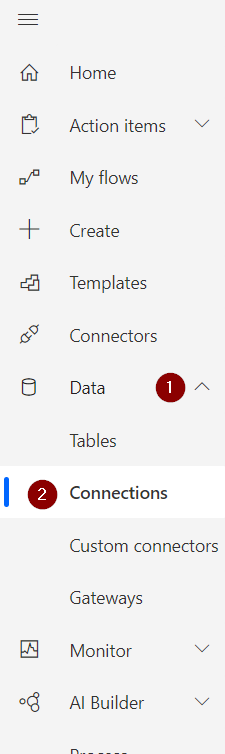

 Press the `New connection` button.
 
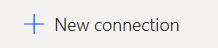

 In the next screen select the `Office 365 Outlook` connection.

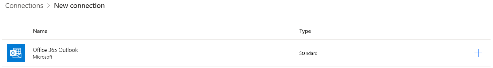

 Click the `Create` button in the pop-up.

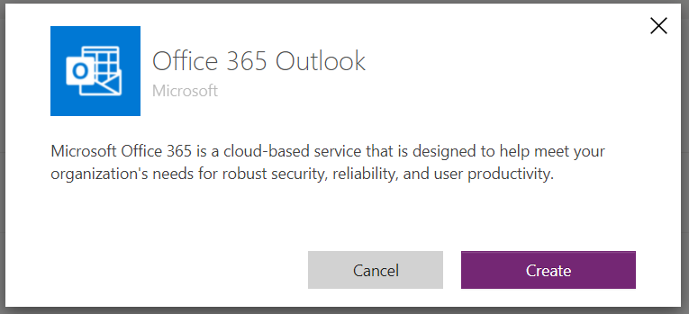

 You will be redirected to your companies login page. Allow Power Automate to interact with Outlook. Your connection is now ready to use.

### Create a new flow
 Click the `Create` button. 

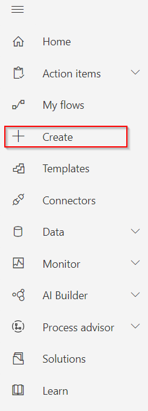

In the `Start from blank` section choose the `Scheduled cloud flow` button.

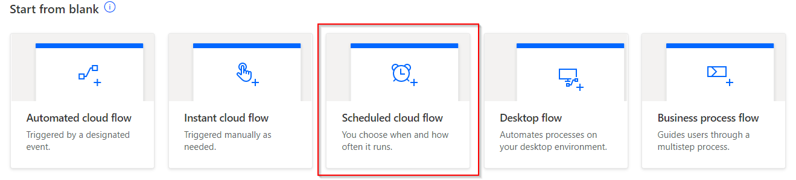 

### Build a scheduled cloud flow
You are confronted with a pop-up to build your scheduled cloud flow:

1. Give your flow a name. I chose `AutoffOffice`.
2. Choose a starting date. The provided default is fine.
3. Set the interval to `1 Hour`. This will run the flow every hour.
4. Finally, press the `Create` button.

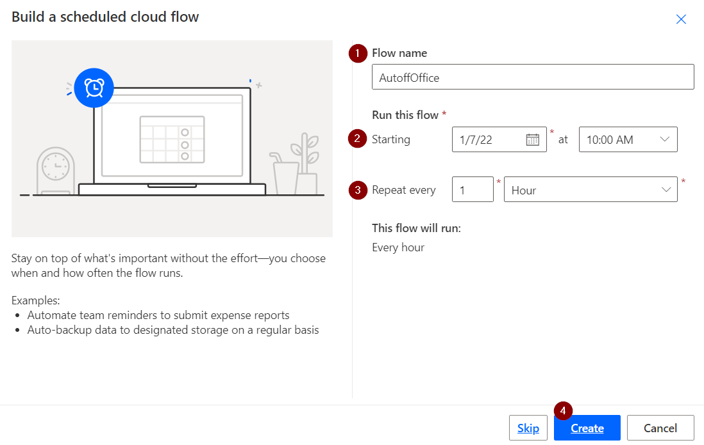

## AutoffOffice flow
At last, you can build and configure your AutoffOffice flow.

First we will take a brief look into the steps the flow will take in order to achieve its goal.

1. Initialize and set variables
2. Get events from your Outlook Calendar
3. Check if events apply for Automatic Replies
4. Enable or disable Automatic Replies based on previous checks

### Recurrence
The `Recurrence` step is automatically created by the [Build a scheduled cloud flow](#build-a-scheduled-cloud-flow).

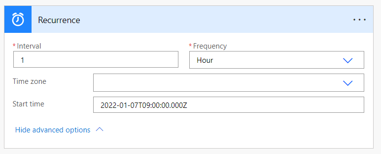

### Current time
Add a new `Current time` step.

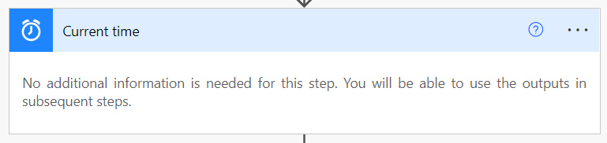

### Get future time
Add a new `Get future time` step and configure its interval to `2 Hours`

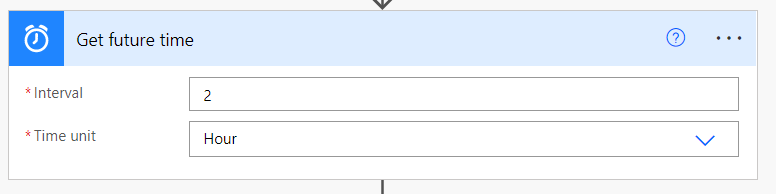

### Initialize variable (startTime)
Add a new `Initialize variable` step. Set its name to `startTime` and its type to `String`. Initialize the variable using the `getFutureTime` expression from the `Dynamic content` section and configure the expression accordingly:
```js
getFutureTime(1, 'year')
```
For better readability you can rename this step to `Initialize startTime`.

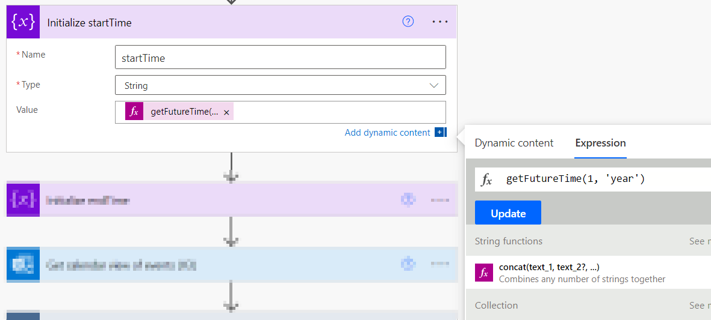

### Initialize variable (endTime)
Add a new `Initialize variable` step. Set name to `endTime` and type to `String`. Initialize the variable using the `getPastTime` expression from the `Dynamic content` section and configure the expression accordingly:
```js
getPastTime(1, 'year')
```
For better readability you can rename this step to `Initialize endTime`.

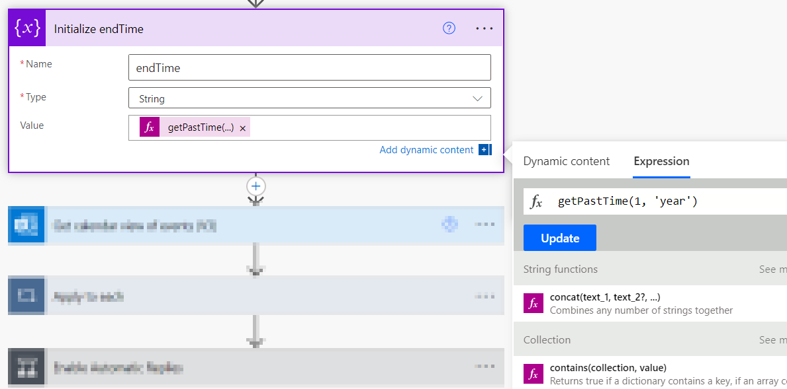

### Get calendar view of events (V3)
Add a new `Get calendar view of events (V3)` step. Select your `Calendar Id` and configure the `Start time` with the `Current time` variable from the  `Dynamic content` section.

Configure the `End time` with the `Future time` variable from the  `Dynamic content` section.

In the `Search` field add `AutoffOffice`

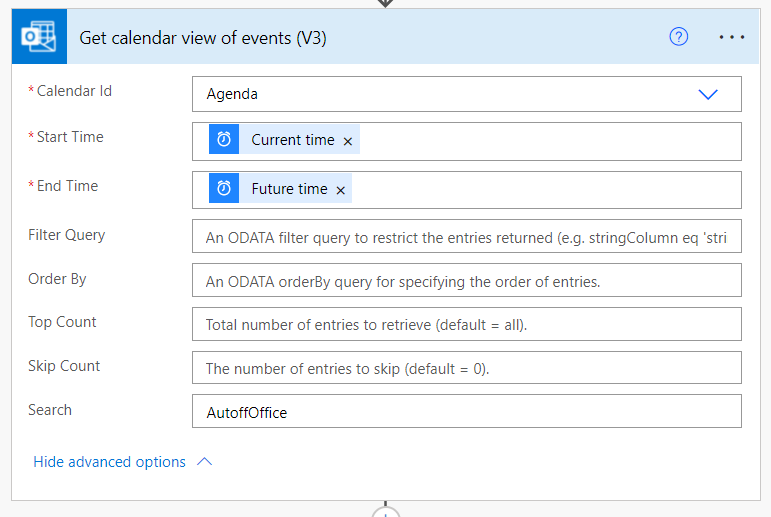

### Apply to each
Add a `Apply to each` step. Select `value` from the `Dynamic content` section for the `Select an output from previous steps` field.

This will create and embody a loop that iterates over all the events fetched in the [Get calendar view of events (V3)](#get-calendar-view-of-events-v3) step.

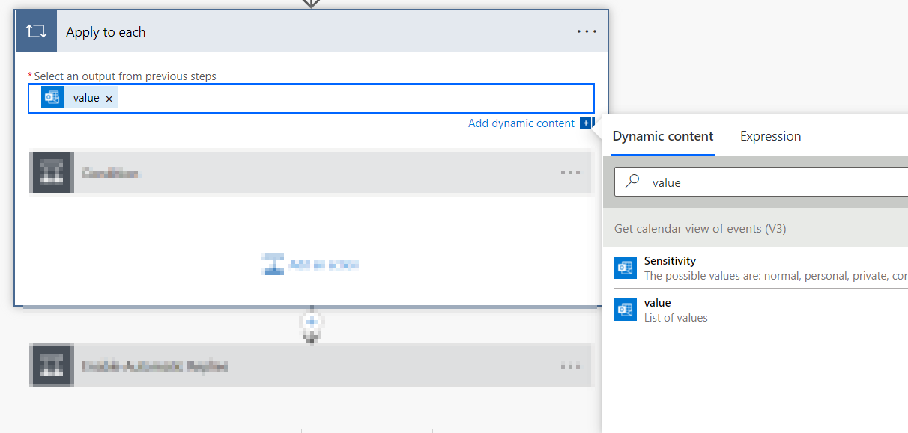

### Condition (Show as Out of Office)
Inside the [Applty to each](#apply-to-each) click the `Add an action` button and add select `Condition`. Select `Show as` from the `Dynamic content` section as `value` and select `is equal to` as comparator. Finally set `oof` as `value` for the comparison.

This will create a junction with a `If yes` and a `If no` flow. The `If no` can be left empty in this `Condition`.

For better readability you can rename this action to `Show as Out of Office`

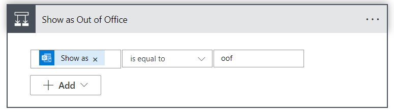

### Condition (Minimize startTime)
Inside the `If yes` branch of the [Show as Out of Office](#condition-show-as-out-of-office) condition add a `Condition` action.

Select `Start time` from the `Dynamic content` section as `value` and select `is less than` as comparator. Finally select the `startTime` variable from the `Dynamic content` section for the comparison.

This will create a junction with a `If yes` and a `If no` flow. The `If no` can be left empty in this `Condition`.

For better readability you can rename this action to `Minimize startTime`

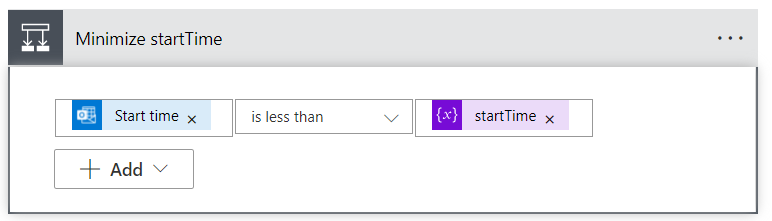

### Set variable (Set startTime with Start time)
Inside the `If yes` branch of the [Minimize startTime](#condition-minimize-starttime) condition add a `Set variable` action. Select `startTime` as `Name` and select `Start time` as `Value` from the `Dynamic content` section.

For better readability you can rename this action to `Set startTime with Start time`

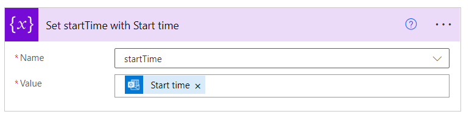


### Condition (Maximize endTime)
Inside the `If yes` branch of the [Show as Out of Office](#condition-show-as-out-of-office) condition add a `Condition` action.

Select `End time` from the `Dynamic content` section as `value` and select `is greater than` as comparator. Finally select the `endTime` variable from the `Dynamic content` section for the comparison.

This will create a junction with a `If yes` and a `If no` flow. The `If no` can be left empty in this `Condition`.

For better readability you can rename this action to `Maximize endTime`

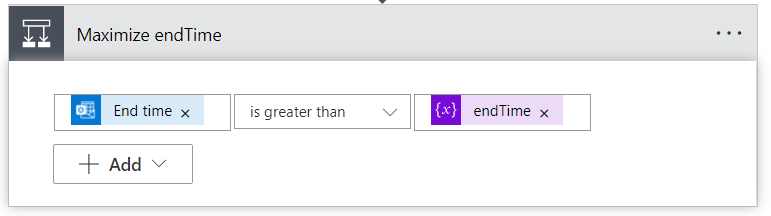

### Set variable (Set endTime with End time)
Inside the `If yes` branch of the [Maximize endTime](#condition-maximize-endtime) condition add a `Set variable` action. Select `endTime` as `Name` and select `End time` as `Value` from the `Dynamic content` section.

For better readability you can rename this action to `Set endTime with End time`

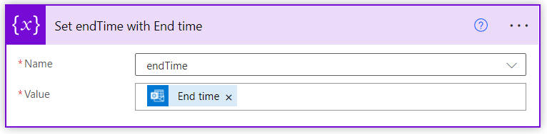

### Condition (Enable Automatic Replies)
Add a new `Condition` step. Select the `startTime` variable from the `Dynamic content` section as `value` and select `is less than` as comparator. Finally select the `endTime` variable from the `Dynamic content` section for the comparison.

This will create a junction with a `If yes` and a `If no` flow.

For better readability you can rename this step to `Enable Automatic Replies`

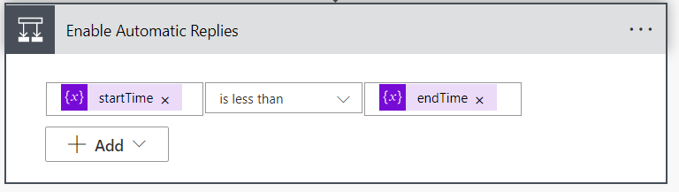

### Set up automatic replies (V2) (Schedule Automatic Replies)
Add a new `Set up automatic replies (V2)` action inside the `If yes` branch of the [Enable Automatic Replies](#condition-enable-automatic-replies) condition. 

Select `Scheduled` as `Status` and configure `All` for `External Audience`. You can configure this to your own preference.

Select the `startTime` variable from the `Dynamic content` section for the `Start time DateTime`.

Select the `endTime` variable from the `Dynamic content` section for the `End time DateTime`.

Both the `Internal Reply Message` and `External Reply Message` allow HTML to style your automatic replies. New and blank lines won't show up in the final messages.

Dynamic content and/or Expressions are also allowed within these text fields. I use the following reply messages:

**Internal (in Dutch)** :netherlands:
```html
Beste Collega,<br><br>
Bedankt voor je email. Op dit moment ben ik niet aanwezig.<br>
Vanaf @{convertTimeZone(variables('endTime'),'UTC','W. Europe Standard Time','dddd d MMMM yyyy')} verwacht ik weer terug te zijn.<br>
Uw bericht wordt niet doorgestuurd.<br><br>
Met vriendelijke groet,<br>
Mathijs
```

**External (in English)** :gb: 
```html
Dear Sender,<br><br>
Thank you for your email. At this moment I am Out of Office.<br>
I expect to be back at @{convertTimeZone(variables('endTime'),'UTC','W. Europe Standard Time','dddd d MMMM yyyy')}.<br>
Your message will not be forwarded.<br><br>
Kind regards,<br>
Mathijs de Kruyf
```

As you can see an `Expression` is used in both the messages:
```js
convertTimeZone(variables('endTime'),'UTC','W. Europe Standard Time','dddd d MMMM yyyy')
```
This will convert and pretty print the `endTime` of your Out of Office event(s) from UTC to my time zone.

See [Microsofts Default Time Zones](https://docs.microsoft.com/en-us/windows-hardware/manufacture/desktop/default-time-zones?view=windows-11) for your own time zone.

**Remark**

Localization is currently and unfortunatly not available in Power Automate. Therefore the day and month will be in English.

For better readability you can rename this action to `Schedule Automatic Replies`

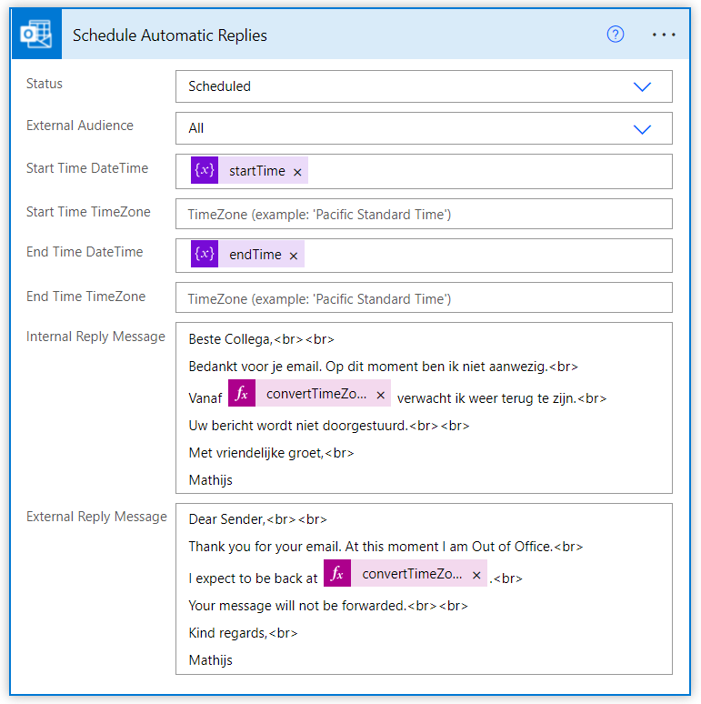

### Set up automatic replies (V2) (Disable Automatic Replies)
Add a new `Set up automatic replies (V2)` action inside the `If no` branch of the [Enable Automatic Replies](#condition-enable-automatic-replies) condition. 

Select `Dsiabled` as `Status` and configure `None` for `External Audience`. Leave all the other text fields empty.

For better readability you can rename this action to `Disable Automatic Replies`

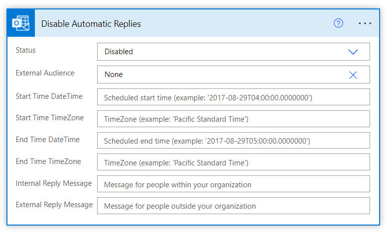

### Finalize
There is a neat `Flow checker` that will give you an early warning or error in case of faults in your flow. 

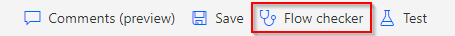

Finally you'll end up with a flow that looks something like this.

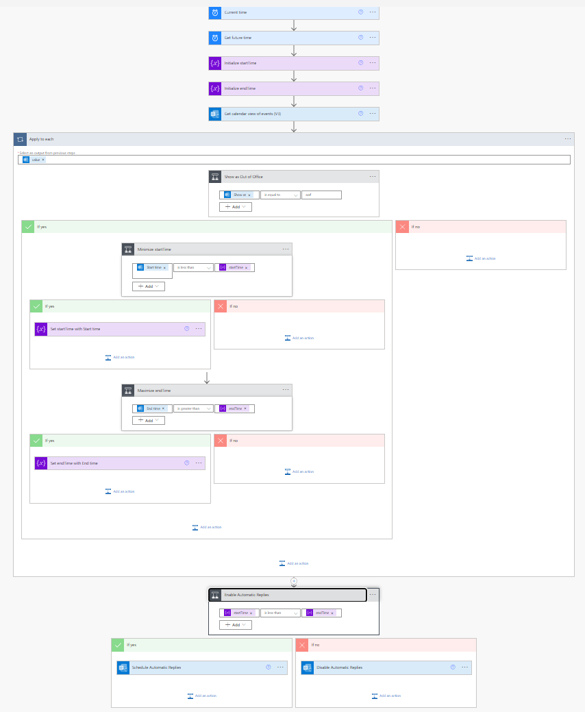

## Run AutoffOffice flow
After you saved your `AutoffOffice` flow, you can Run it for the first time. This will test whether all variables are initialized and the steps are configured correctly.

Click the `Test` flask in the top right corner and select `Manually` as the `Test Flow`. The `Save & Test` or `Test` button will light up. Click it and press the `Run flow` in the next screen. Your flow will now run.

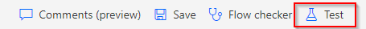

Afterwards you can review and debug the steps, data and conditions on the `Flow Runs Page`. This will also show historical runs, both scheduled and manual runs. 

## Outlook Calendar
Finally we can add events (Appointments) to our Outlook Calendar for the AutoffOffice flow to pick up.

### Appointments
In order for the AutoffOffice flow to enable Automatic replies during your absence make sure that Appointments meet the following two criteria:
1. Show As must be set to "Out of Office". This is configured in step [Condition (Show as Out of Office)](#condition-show-as-out-of-office).
2. Either the subject (Title) or body of the Appointment must contain the word `AutoffOffice`. This is configured in step [Get calendar view of events (V3)](#get-calendar-view-of-events-v3) under the `Search` step.

When these two criteria are met, the AutoffOffice flow will schedule an Automatic Reply during the length of the Appointment.

In case there are multiple and/or overlapping Appointments within the given time frame, the earliest `Start Time` and latest `End Time` will be used when scheduling the Automatic Replies.

## Contributing
This Microsoft Power Automate flow is a "Works for me" solution to provide automatic scheduling of dynamic Automatic Replies in case of Out of Office.

When you spot a bug, optimization, typo or run into problems setting up your own flow: Raise an [Issue](https://github.com/toaomatis/AutoffOffice/issues) or create a [Pull request](https://github.com/toaomatis/AutoffOffice/pulls).